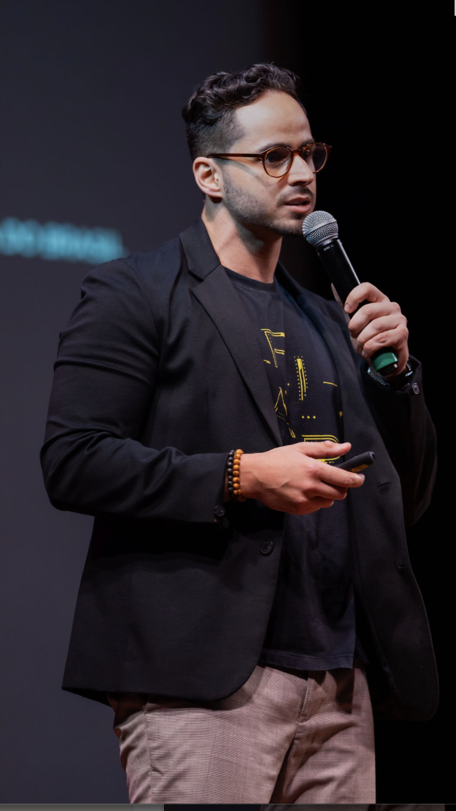

# Adriano Mischiatti — Website Pessoal (Media Kit)

Site institucional de alto padrão para personal branding, desenvolvido em HTML5, CSS3 e JavaScript Vanilla.

## Estrutura de arquivos

```
/
├── index.html          ← Estrutura completa do site
├── style.css           ← Estilos (variáveis, layout, animações, responsivo)
├── script.js           ← Comportamentos (navbar, animações, contadores)
├── assets/
│   ├── images/         ← Fotos e imagens do site
│   ├── icons/          ← Ícones customizados (se necessário)
│   └── logos/          ← Logos de parceiros ou marca
└── README.md
```

## Como usar

1. Abra `index.html` diretamente no navegador — nenhuma dependência ou build step necessário.
2. Para publicar online, faça upload de todos os arquivos para qualquer hospedagem estática (Netlify, Vercel, GitHub Pages, etc.).

## Personalização

### Foto de perfil

Substitua o placeholder no Hero e na seção Sobre:

```html
<!-- Hero: encontre este trecho em index.html e substitua pelo  abaixo -->
<div class="hero-avatar-placeholder">
  <span>AM</span>
</div>

<!-- Substitua por: -->

```

```html
<!-- Sobre: encontre .about-image-placeholder e substitua por: -->

```

Recomendações de imagem:
- **Hero**: quadrada, mínimo 600×600px, foco no rosto
- **Sobre**: retrato vertical, mínimo 760×1000px

### Cores

Todas as cores estão centralizadas no início de `style.css` como variáveis CSS:

```css
:root {
  --primary-navy:   #0A1F44;
  --electric-blue:  #00AEEF;
  --warm-gold:      #F5B700;
  /* ... */
}
```

### Links sociais

Atualize os `href` das redes sociais diretamente no `index.html`:

| Rede       | Buscar por                    |
|------------|-------------------------------|
| LinkedIn   | `linkedin.com/in/adrianomischiatti` |
| Instagram  | `instagram.com/adrianomischiatti`   |
| YouTube    | `youtube.com/@techparanaotec`       |

### E-mail de contato

Substitua `contato@adrianomischiatti.com.br` pelo e-mail real nos botões da seção CTA.

### Agendamento (Calendly)

Substitua `https://calendly.com/adrianomischiatti` pelo link real do Calendly no botão "Agendar uma conversa".

### Media Kit PDF

No `script.js`, o botão de download do Media Kit mostra uma mensagem enquanto o PDF não está disponível. Para ativar o download real:

1. Adicione o arquivo em `assets/` (ex: `assets/adriano-mischiatti-mediakit.pdf`)
2. No `index.html`, atualize o `href` do botão `.mediakit-download`

### Favicon

O favicon atual é gerado via SVG inline. Para usar um favicon real:

1. Coloque `favicon.ico` (ou `favicon.png`) na raiz do projeto
2. Substitua a tag `<link rel="icon" ...>` no `<head>`:

```html
<link rel="icon" type="image/png" href="favicon.png" />
```

### Open Graph (redes sociais)

Para que o link do site apareça com preview rico ao ser compartilhado:

1. Crie uma imagem `assets/images/og-image.jpg` (1200×630px)
2. As meta tags OG já estão configuradas no `<head>` do `index.html`

## Tecnologias utilizadas

- **HTML5** — semântico, acessível, SEO-ready
- **CSS3** — variáveis, Grid, Flexbox, animações, responsivo
- **JavaScript Vanilla** — Intersection Observer, contadores, menu mobile
- **Google Fonts** — Bebas Neue + Montserrat

## Hospedagem recomendada

| Plataforma | Notas |
|------------|-------|
| **Netlify** | Drag & drop da pasta, domínio customizado gratuito |
| **Vercel**  | Deploy instantâneo via CLI ou GitHub |
| **GitHub Pages** | Gratuito, integrado ao repositório |

## Domínio sugerido

`www.adrianomischiatti.com.br`
